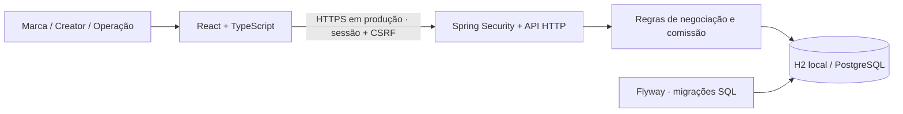

# Reformulação do GoInsiders Match

Decisão de 16/09/2026. Contexto: produto piloto de descoberta de creators por marcas, com operação comercial GoInsiders e comissão fixa de 30%. O objetivo é tornar a descoberta agradável e a negociação confiável, com operação compatível com uma equipe pequena.

## Decisão técnica

**React + TypeScript no frontend; Java 21 + Spring Boot no backend; PostgreSQL como destino de produção; monólito com fronteiras de responsabilidade.** Vite compila o frontend e fornece atualização imediata no desenvolvimento. Em produção, o Spring entrega os arquivos estáticos e a API na mesma origem: um único serviço de aplicação, sem servidor Node adicional.

Não existe linguagem universalmente melhor. A decisão considera o código que já existe, a carga de trabalho (catálogo, filtros e transações), o custo de mudança e a facilidade de manutenção. Java permanece por mérito: a aplicação já tem segurança de sessão, autorização, transações, cálculo monetário exato e testes. Reescrever essas regras em outra linguagem não é necessário para melhorar o uso.

| Alternativa avaliada | Vantagem neste contexto | Custo ou limitação | Decisão |
|---|---|---|---|
| React + TypeScript + Vite | Componentes, contratos tipados, estados explícitos e desenvolvimento rápido | Build e dependências passam a existir | Adotada para substituir a interface montada por strings |
| Java + Spring Boot | Reaproveita regras transacionais e segurança existentes; um artefato executável | Runtime JVM e duas linguagens na equipe | Mantida e evoluída |
| TypeScript também no servidor | Uma linguagem de ponta a ponta | Reimplementação e revalidação de autenticação, concorrência e finanças | Boa opção para um projeto novo, sem benefício suficiente para esta migração |
| Next.js com renderização no servidor | Útil para conteúdo público indexável | Fluxo central é autenticado; acrescentaria outro servidor sem necessidade atual | Reavaliar se catálogo público e SEO virarem requisitos |
| Flutter / React Native | Integração nativa, distribuição em lojas | Outra entrega, revisão de lojas e manutenção adicional | Adiar até necessidade comprovada de recursos nativos |
| Kotlin | Boa interoperabilidade com a JVM | Migração de sintaxe sem melhoria perceptível do produto atual | Não adotar agora |
| Go / Rust | Controle de recursos e serviços especializados | Reescrita e mais especialização sem gargalo medido | Não adotar agora |

A referência Tinder é **de interação**: descoberta focada, uma decisão por vez, gesto com retorno visual, desfazer e navegação curta. Não é uma afirmação sobre o stack interno do Tinder nem uma justificativa para reproduzir sua infraestrutura de escala global. Aqui, um interesse é comercial e nunca confirma reciprocidade ou contratação automaticamente.

## Organização implementada

- `frontend/src/components`: descoberta, autenticação, proposta, negociações e elementos compartilhados.
- `frontend/src/types.ts`: contratos consumidos pela interface. A validação definitiva continua no servidor; tipos TypeScript não validam JSON em runtime.
- `frontend/src/api.ts`: sessão, CSRF, erros e transporte. Nenhum token de login ou senha é guardado em localStorage.
- `frontend/src/domain.ts`: conversão exata para centavos e projeção das etapas disponíveis. O servidor continua autorizando transições.
- Backend: controller HTTP, modelos/validação, serviço transacional, segurança, carga demo e erros. Ainda cabe em um módulo Maven; separar pacotes por domínio conforme cada domínio crescer, sem criar serviços de rede antecipadamente.
- Flyway: V1 representa o schema inicial; V2 acrescenta índices para ordenação e consultas de negociações/histórico. Migrações já aplicadas são imutáveis.

Estado de sessão, filtros, dados do servidor e modal são separados. Filtros novos cancelam solicitações antigas; respostas canceladas não substituem a seleção atual. Formulários bloqueiam reenvio enquanto aguardam o servidor. O backend mantém a restrição única e transações como garantia final de consistência.

## Dados e evolução

O modelo atual contém `creators`, `deals` e `deal_events`. Uma negociação guarda os valores e as políticas comerciais vigentes na criação. Não recalcular negociações antigas com a configuração atual. Dinheiro é inteiro em centavos, nunca ponto flutuante. Aceite, transição e histórico são verificados no servidor.

PostgreSQL é a escolha de produção pela adequação a relacionamentos, restrições e transações deste domínio. H2 permanece para experimentar sem administrar um serviço extra. Há um Compose opcional com PostgreSQL 17 e uma tarefa CI que executa a suíte de integração contra esse banco. Isso não equivale a um benchmark ou a uma implantação validada em produção.

Próxima evolução do modelo, antes de abertura pública: `users`, `organizations`, `memberships`, vínculo explícito usuário/creator, `campaigns`, versões de propostas e consentimentos. A restrição atual de uma negociação por marca/creator será substituída por unicidade por campanha + creator + chave de idempotência, com migração e testes. Evitar mudar essa regra implicitamente durante o redesign.

Para fotos e mídia reais, usar armazenamento de objetos, URLs controladas, limite/tipo de arquivo, autorização de uso e curadoria. Esta entrega usa identidades gráficas por iniciais, sem associar fotos de desconhecidos aos perfis fictícios. Métricas precisam de origem, data de coleta e política de atualização antes de representar dados verificados.

## Operação e escalabilidade

Começar com uma instância da aplicação e PostgreSQL gerenciado. O frontend é estático, com assets versionados por hash e fontes locais. Não há dependência de fontes ou imagens de terceiros durante o uso. O modo web responsivo permite acessar pelo celular sem instalar um app. Não há service worker nem uso offline autenticado nesta entrega.

Adicionar paginação por cursor quando o catálogo crescer; hoje a API retorna a coleção completa. Medir consultas, volume e latência antes de introduzir cache. Adicionar processamento assíncrono e outbox quando existirem notificações e integrações externas. Para múltiplas instâncias, migrar sessões para armazenamento compartilhado e revisar inicialização/migrações. Não introduzir Kubernetes, Kafka, Redis ou microsserviços sem necessidade medida.

O Compose PostgreSQL é para desenvolvimento/piloto local. Produção ainda requer TLS, segredos externos, backup com restauração ensaiada, migração em ambiente de homologação, métricas e alertas. Não expor contas demo publicamente. A aplicação não envia mensagens externas, movimenta dinheiro nem gerencia contratos.

## Requisitos e critérios de aceite

| Área | Requisito | Critério verificável / situação |
|---|---|---|
| Descoberta | Um creator por vez; passar, voltar e demonstrar interesse | Gesto horizontal com limiar e botões equivalentes; voltar desfaz apenas o último perfil pulado |
| Filtros | Produto, universo do creator, UF, seguidores e engajamento | Cumulativos, validados no servidor; filtros recolhíveis no celular |
| Interesse | Briefing e orçamento antes de envio | Botão bloqueado sem briefing ou cotação válida; envio não contrata |
| Transparência | Comissão e total antes de confirmar | Cotação do servidor; política registrada na negociação |
| Acompanhamento | Fila, responsável, etapas e histórico | Marca vê suas negociações; operação altera etapas; creator responde quando elegível |
| Recuperação | Falha de rede, sessão expirada, resultado vazio | Erro visível, possibilidade de tentar novamente e limpeza da sessão |
| Acessibilidade | Teclado, rótulos, foco, movimento reduzido | Botões para todos os gestos, dialog nativo, foco visível, `aria-live`, respeito a movimento reduzido; auditoria completa ainda pendente |
| Responsividade | Operação em celular e desktop | Testes Chromium em 390px e 1280px, sem rolagem horizontal; verificar também Safari/Firefox antes do lançamento |
| Banco | Evolução controlada e preservação de dados | Flyway e teste de adoção do schema anterior; baseline explícito |
| Confiabilidade | Sem duplicidade e sem transição indevida | Garantias transacionais e testes de integração existentes |

Metas de produção, ainda não medidas: p95 de leitura da API abaixo de 300ms no ambiente-alvo; LCP abaixo de 2,5s e INP abaixo de 200ms em dispositivos representativos; disponibilidade mensal de 99,5% para o piloto. Essas metas exigem telemetria, definição de carga e orçamento de infraestrutura. Não são resultados desta entrega.

Métricas do produto: tempo até o primeiro interesse qualificado, proporção interesse→aceite→fechamento e tempo de resposta operacional. Evitar otimizar quantidade de swipes sem observar qualidade das parcerias. Instrumentação analítica ainda não implementada.

## Sequência de implantação

1. Validar esta experiência com marcas, creators e equipe comercial usando dados fictícios.
2. Implantar identidade persistida, organizações, recuperação de conta, catálogo administrável e métricas com procedência.
3. Implementar campanhas e propostas revisáveis para tratar recorrência e orçamento negociado.
4. Preparar privacidade, consentimentos, moderação, backups, observabilidade, limites de acesso e homologação de segurança.
5. Adicionar notificações, contratos e pagamentos somente com regras e provedores definidos. Aplicativo nativo e recomendação personalizada dependem de uso e demanda medidos.

## Referências consultadas

- [React: aplicação com Vite e TypeScript](https://react.dev/learn/build-a-react-app-from-scratch).
- [React: uso de TypeScript](https://react.dev/learn/typescript).
- [Spring Boot: aplicações executáveis](https://spring.io/projects/spring-boot/).
- [Spring: inicialização e migração do banco](https://docs.spring.io/spring-boot/how-to/data-initialization.html).
- [Flyway: baseline explícito](https://documentation.red-gate.com/fd/flyway-baseline-on-migrate-setting-277578974.html).
- [PostgreSQL: isolamento de transações](https://www.postgresql.org/docs/18/transaction-iso.html).

As fontes sustentam capacidades das ferramentas. A escolha de arquitetura é uma avaliação específica deste projeto.
