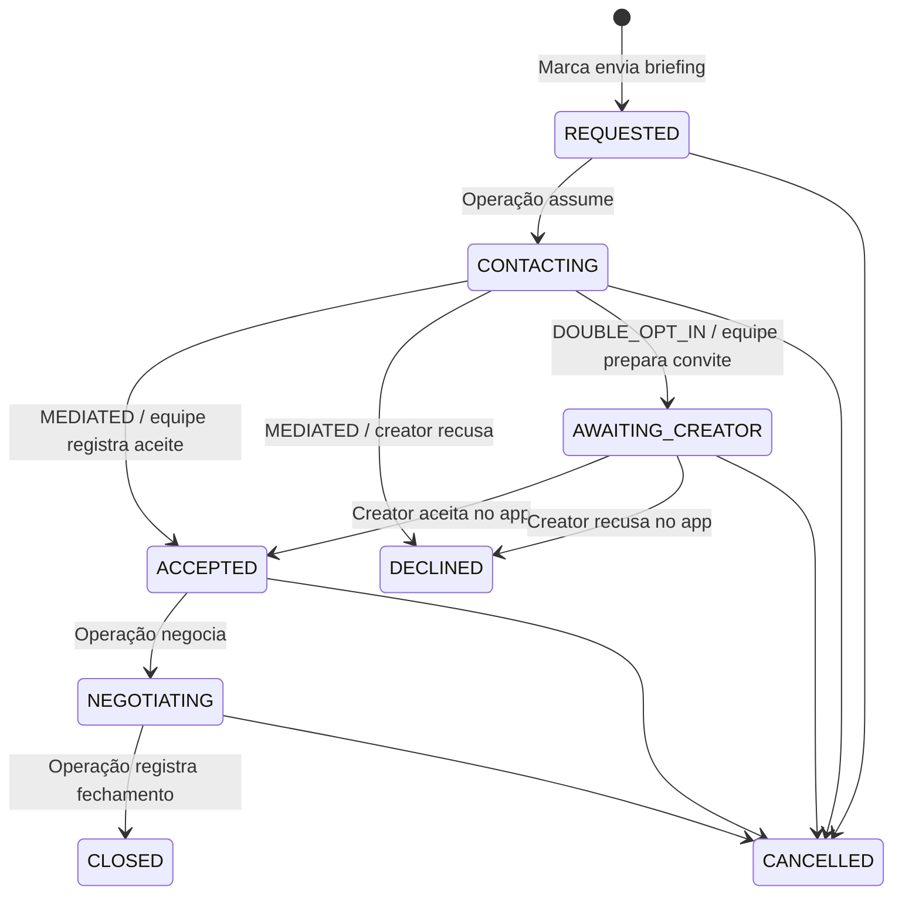

# Regras e operação

## Proposta

Conectar marcas a creators com critérios objetivos e uma equipe que acompanha a negociação. A seleção da marca é um sinal de interesse, nunca uma contratação automática. O produto funciona separado do marketplace de campanhas abertas e autosserviço.

## Etapas

Fechada, recusada e cancelada são etapas terminais neste MVP. A operação sempre informa responsável e uma observação para alterar a etapa. No modo intermediado, o registro do aceite deve descrever quando e por qual canal o creator concordou. A validação do conteúdo dessa evidência é responsabilidade operacional; o sistema não comprova uma mensagem externa.

No modo de dupla aprovação, a operação não consegue pular o aceite do creator. O aceite sinaliza disposição para negociar, sem dispensar a contratação posterior.

## Matriz de acesso

| Ação | Marca | Operação | Creator |
|---|---|---|---|
| Consultar catálogo | Sim | Sim | Sim |
| Enviar interesse | Sim | Não | Não |
| Consultar negociações | Somente próprias | Todas | Próprias, em dupla aprovação, após início do contato |
| Mudar etapa operacional | Não | Sim | Não |
| Aceitar/recusar no app | Não | Não | Próprios convites aguardando aceite |

Cada solicitação guarda política, investimento, comissão e execução calculados no servidor. Uma restrição única no banco impede duplicações; bloqueio de linha e transação serializam mudanças na mesma negociação. Etapa e histórico são persistidos juntos.

## Escopo financeiro

Moeda: BRL. Investimento de R$ 1 a R$ 1.000.000, com duas casas decimais. Comissão fixa de 30%. Arredondamento de meio centavo para cima. O sistema registra estimativas por negociação e totais de parcerias fechadas; não é um livro contábil nem processador de pagamento.

As regras confirmadas para a primeira versão são **MEDIATED** (a GoInsiders obtém e registra o aceite) e **INCLUDED** (30% incluídos no investimento total, separados do modelo de posts). As alternativas implementadas dependem de uma mudança deliberada de configuração.

## Rotina sugerida para a equipe

1. Qualificar produto, objetivo, entregas, prazo e orçamento do briefing.
2. Atribuir responsável e validar métricas/disponibilidade do creator.
3. Fazer contato e obter concordância, registrando o resultado.
4. Negociar entregas, calendário, uso de imagem/conteúdo e condições comerciais.
5. Formalizar contratação e confirmar valores fora do app antes de marcar fechamento.
6. Acompanhar execução e pagamentos nos processos operacionais existentes.

O MVP exige correspondência entre o valor registrado e o valor fechado. Caso o orçamento mude na negociação, será necessário implementar uma revisão da proposta antes de usar o app para esses casos. Integração com campanhas/posts preexistentes depende do fornecimento de seus contratos de dados e regras.
